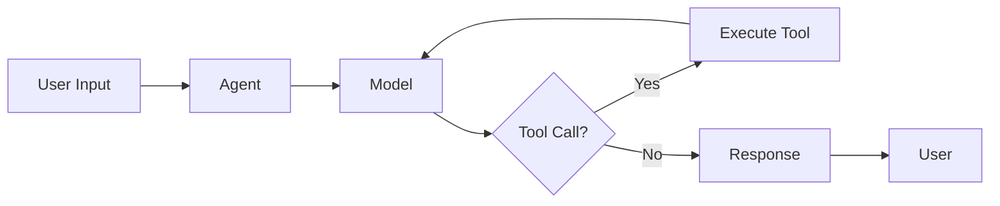

## Architecture

AgentScope is built around four core concepts:

<CardGroup cols={2}>
    <Card title="Agent" icon="robot" href="/core/agent">
        The main orchestrator that coordinates models, tools, and memory
    </Card>
    <Card title="Model" icon="brain" href="/core/model">
        Language model integrations (OpenAI, Anthropic, DashScope, etc.)
    </Card>
    <Card title="Tool" icon="wrench" href="/core/tool">
        Functions that agents can call to interact with the world
    </Card>
    <Card title="Event" icon="bolt" href="/core/event">
        Event-driven system for tracking agent lifecycle and streaming
    </Card>
</CardGroup>

## How It Works



### 1. Agent Receives Input

The agent receives a message from the user or another agent.

### 2. Model Processes Request

The language model analyzes the input and decides whether to:

- Respond directly
- Call one or more tools
- Request user confirmation

### 3. Tool Execution

If tools are needed, the agent:

- Validates tool calls
- Executes tools (with optional user confirmation)
- Feeds results back to the model

### 4. Response Generation

The model generates a final response based on:

- Original input
- Tool execution results
- Conversation history

## Key Features

### Event-Driven Architecture

AgentScope uses an event system to track every step:

```typescript
for await (const event of agent.replyStream({})) {
    switch (event.type) {
        case EventType.RUN_STARTED:
            console.log('Agent started');
            break;
        case EventType.TOOL_CALL_START:
            console.log('Calling tool:', event.toolCallName);
            break;
        case EventType.TEXT_BLOCK_DELTA:
            process.stdout.write(event.delta);
            break;
    }
}
```

### Human-in-the-Loop

Built-in support for user confirmation:

```typescript
const agent = new Agent({
    name: 'Friday',
    model: model,
    toolkit: toolkit,
    requireUserConfirm: true, // Require confirmation for tool calls
});
```

### Memory Management

Automatic memory compression for long conversations:

```typescript
const agent = new Agent({
    name: 'Friday',
    model: model,
    memory: {
        maxTokens: 4000,
        compressionRatio: 0.5,
    },
});
```

## Next Steps

<CardGroup cols={2}>
    <Card title="Agent" icon="robot" href="/core/agent">
        Learn about agent configuration and lifecycle
    </Card>
    <Card title="Model" icon="brain" href="/core/model">
        Explore supported models and configurations
    </Card>
    <Card title="Tool" icon="wrench" href="/core/tool">
        Create and use tools
    </Card>
    <Card title="Event" icon="bolt" href="/core/event">
        Understand the event system
    </Card>
</CardGroup>
