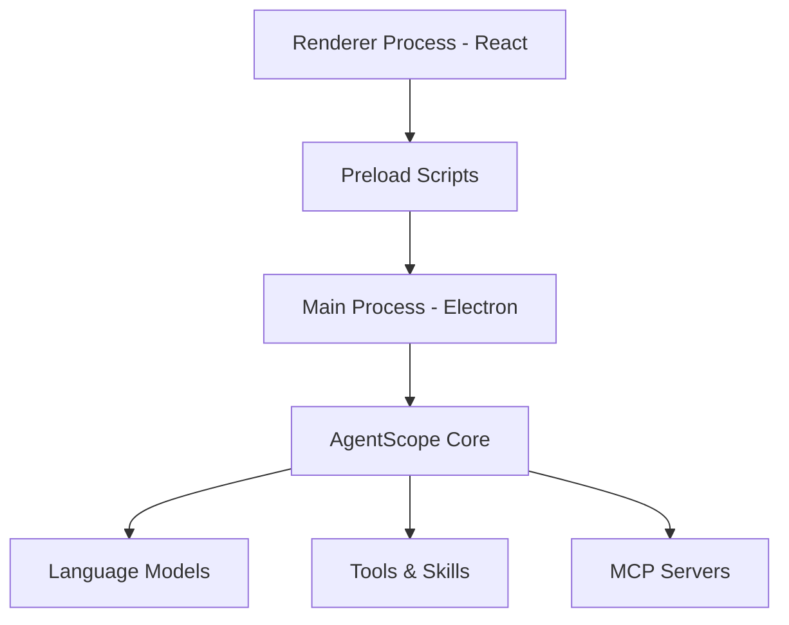

## Overview

Friday is built with a modern Electron architecture separating concerns between main process, renderer process, and preload scripts.

## Architecture Diagram

## Components

### Main Process

Handles:

- Agent lifecycle management
- IPC communication
- File system operations
- Database management

### Renderer Process

Handles:

- UI rendering with React
- User interactions
- Message display
- Real-time updates

### Preload Scripts

Provides secure bridge between renderer and main process.

## Next Steps

<Card title="Development Guide" icon="code" href="/friday/development">
    Learn how to develop Friday
</Card>
